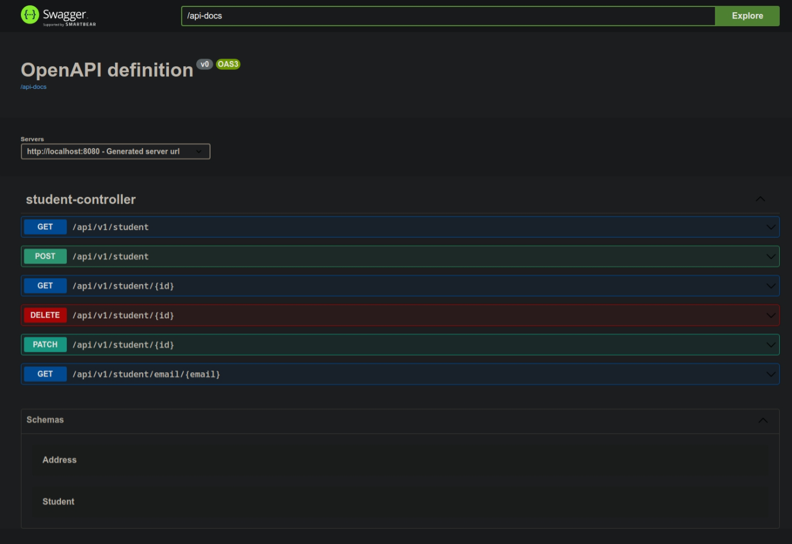

# Spring Boot JPA

This repository contains multiple projects developed with Spring Boot and JPA, each one connecting to a differente database such as PostgreSQL, MySQL, SQL Server and MongoDB. The projects are really simple RESTful APIs with the sole purpose of learning about how JPA connects and interacts with each one of them.

## Features

- Create, read, update, and delete records
  
- Store information in a SQL or NoSQL database
  
- RESTful API for easy integration with other systems

## Architecture

The applications in this repository are built using Spring Boot and following the N-tier architecture (3-tier to be exact):

- `Controller`: Handles incoming HTTP requests and maps them to the appropriate service methods
  
- `Service`: Contains the business logic for managing student records and interacts with the repository layer
  
- `Repository`: Provides an abstraction for interacting with the MongoDB database

- `Database`: The database of the application. Each api will be interacting with one accordingly to their name

## Getting Started

### Prerequisites

- Java 17 or higher
- Maven
- MongoDB (to run spring-mongodb)
- SQL Server (to run spring-sqlserver)
- PostgreSQL (to run spring-postgresql or spring-transactions)
- MySQL (to run spring-mysql)

### Installation

1. Clone the repository
git clone https://github.com/athirsonsilva/spring-boot-jpa.git


2. Change to project directory

```bash
cd spring-boot-jpa
```

3. To run any application, change to one directory and run
  
```bash
./mvnw spring-boot:run
```

The application will start and be available at `http://localhost:8080`. When accessing the address, you will see the Swagger UI documentation screen similar to this:

